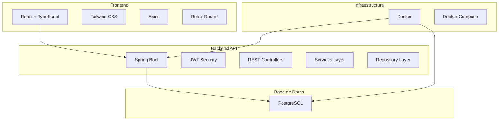

# 🎉 Punto Evento

[](https://www.oracle.com/java/)
[](https://spring.io/projects/spring-boot)
[](https://reactjs.org/)
[](https://www.typescriptlang.org/)
[](https://www.postgresql.org/)
[](https://docs.docker.com/compose/)

## 🚀 Descripción

**Punto Evento** es una plataforma integral de gestión de eventos que permite organizar, planificar y administrar eventos de manera eficiente. El sistema está diseñado para empresas de eventos que necesitan gestionar clientes, empleados, reservas, cotizaciones y tareas de manera centralizada.

### 🎯 Propósito
- **Organización de eventos** completa desde la solicitud hasta la ejecución
- **Gestión de clientes** con perfiles detallados y historial
- **Administración de empleados** con asignación de tareas
- **Sistema de cotizaciones** con seguimiento de estados
- **Reservas y planificación** de eventos
- **Control de tareas** y asignaciones

---

## 🏗️ Arquitectura



---

## ✨ Características Principales

### 🔐 Autenticación y Autorización
- ✅ **JWT Authentication** con refresh tokens
- ✅ **Sistema de roles** (ADMIN, EMPLOYEE, CLIENT)
- ✅ **Protección de rutas** por rol
- ✅ **Gestión de sesiones** segura

### 👥 Gestión de Usuarios
- ✅ **Registro de clientes** público
- ✅ **Gestión de empleados** por administradores
- ✅ **Perfiles de usuario** completos
- ✅ **Estados de usuario** (Activo/Inactivo)

### 📋 Módulos del Sistema
- ✅ **Gestión de Clientes** - CRUD completo
- ✅ **Gestión de Empleados** - Contratos y asignaciones
- ✅ **Solicitudes de Eventos** - Flujo de aprobación
- ✅ **Sistema de Cotizaciones** - Estados y seguimiento
- ✅ **Reservas de Eventos** - Planificación y ejecución
- ✅ **Gestión de Tareas** - Asignación y seguimiento
- ✅ **Asignaciones** - Relación empleados-tareas

### 🎨 Frontend Moderno
- ✅ **Interfaz responsiva** con Tailwind CSS
- ✅ **Componentes reutilizables** en React
- ✅ **Navegación por roles** dinámica
- ✅ **Animaciones** con Framer Motion
- ✅ **Formularios validados** con TypeScript

---

## 🛠️ Tecnologías Utilizadas

| Área | Tecnologías |
|------|-------------|
| **Frontend** | React 19.1.0, TypeScript 5.8.3, Tailwind CSS 4.1.8, Vite 6.3.5 |
| **Backend** | Java 17, Spring Boot 3.4.0, Spring Security, Spring Data JPA |
| **Base de Datos** | PostgreSQL 15 |
| **Autenticación** | JWT (JSON Web Tokens) |
| **Infraestructura** | Docker, Docker Compose |
| **Herramientas** | Maven, Lombok, Axios, React Router |
| **UI/UX** | Framer Motion, Lucide React, Ant Design |

---

## ✅ Requisitos Previos

- **Java** >= 17
- **Node.js** >= 18
- **Docker** y **Docker Compose**
- **Git**
- **Maven** >= 3.6

---

## ⚙️ Instalación

### 1. Clonar el repositorio

```bash
git clone https://github.com/usuario/proyecto-catedra-dwf.git
cd proyecto-catedra-dwf
```

### 2. Configurar variables de entorno

#### Backend (.env)
```env
# Base de datos
POSTGRES_DB=punto_evento_db
POSTGRES_USER=postgres
POSTGRES_PASSWORD=secret123
POSTGRES_PORT=5432

# Spring Boot
SPRING_DATASOURCE_URL=jdbc:postgresql://localhost:5432/punto_evento_db
SPRING_DATASOURCE_USERNAME=postgres
SPRING_DATASOURCE_PASSWORD=secret123

# JWT
JWT_SECRET=2B4D8F39A2F3C47197D55836C76C441A1B5D2E58E8ACF16C3E0A2F5B6F9D1A32
JWT_EXPIRATION=86400000

# Seeder
APP_SEEDER_ENABLED=true
```

#### Frontend (.env)
```env
VITE_API_URL=http://localhost:8080
```

---

## ▶️ Ejecución

### 🐳 Usando Docker (Recomendado)

```bash
# Levantar la base de datos
cd punto-evento-api
docker-compose up -d

# Ejecutar el backend
./mvnw spring-boot:run

# En otra terminal, ejecutar el frontend
cd punto-evento-frontend
npm install
npm run dev
```

### 📋 Manual (Sin Docker)

```bash
# 1. Configurar PostgreSQL localmente
# 2. Ejecutar el script SQL: punto-evento-api/sql/dump.sql

# Backend
cd punto-evento-api
./mvnw clean install
./mvnw spring-boot:run

# Frontend (nueva terminal)
cd punto-evento-frontend
npm install
npm run dev
```

---

## 📁 Estructura del Proyecto

```
proyecto-catedra-dwf/
├── documents/                        # Documentación del proyecto
│   ├── Manual_Tecnico_PuntoEvento_FINAL.pdf      # Manual técnico completo
│   └── Manual_Usuario_PuntoEvento_FINAL.pdf     # Manual de usuario final
│
├── punto-evento-api/                 # Backend Spring Boot
│   ├── src/main/java/sv/udb/puntoeventoapi/
│   │   ├── config/                   # Configuraciones
│   │   │   ├── security/             # Spring Security
│   │   │   ├── jwt/                  # JWT utilities
│   │   │   └── DataSeeder.java       # Datos iniciales
│   │   ├── modules/                  # Módulos de negocio
│   │   │   ├── auth/                 # Autenticación
│   │   │   ├── user/                 # Gestión de usuarios
│   │   │   ├── client/               # Gestión de clientes
│   │   │   ├── employee/             # Gestión de empleados
│   │   │   ├── request/              # Solicitudes de eventos
│   │   │   ├── quote/                # Sistema de cotizaciones
│   │   │   ├── reservation/          # Reservas de eventos
│   │   │   ├── task/                 # Gestión de tareas
│   │   │   ├── assignment/           # Asignaciones
│   │   │   └── commons/              # Utilidades comunes
│   │   └── PuntoEventoApiApplication.java
│   ├── sql/
│   │   └── dump.sql                  # Script de base de datos
│   ├── docker-compose.yml            # Configuración Docker
│   └── pom.xml                       # Dependencias Maven
│
├── punto-evento-frontend/            # Frontend React
│   ├── src/
│   │   ├── components/               # Componentes React
│   │   │   ├── Buttons/              # Botones reutilizables
│   │   │   ├── Forms/                # Formularios
│   │   │   ├── Header/               # Encabezado
│   │   │   ├── Layout/               # Layouts
│   │   │   └── routes/               # Protección de rutas
│   │   ├── pages/                    # Páginas principales
│   │   │   ├── admin/                # Panel administrador
│   │   │   ├── client/               # Panel cliente
│   │   │   ├── employee/             # Panel empleado
│   │   │   └── auth/                 # Autenticación
│   │   ├── api/                      # Servicios API
│   │   ├── context/                  # Context API
│   │   ├── hooks/                    # Custom hooks
│   │   ├── interfaces/               # Tipos TypeScript
│   │   ├── enums/                    # Enumeraciones
│   │   └── utils/                    # Utilidades
│   ├── package.json                  # Dependencias npm
│   └── vite.config.ts               # Configuración Vite
│
├── QUICK_CREDENTIALS.txt            # Credenciales de prueba
└── README.md                         # Documentación principal del proyecto
```

---

## 🔗 Endpoints Principales de la API

### 🔐 Autenticación
```
POST /auth/register    # Registro de clientes
POST /auth/login       # Inicio de sesión
GET  /auth/me          # Información del usuario actual
```

### 👥 Gestión de Usuarios
```
GET    /users          # Listar usuarios (ADMIN)
POST   /users          # Crear usuario (ADMIN)
PUT    /users/:id      # Actualizar usuario (ADMIN)
DELETE /users/:id      # Eliminar usuario (ADMIN)
```

### 🏢 Gestión de Clientes
```
GET    /clients        # Listar clientes
POST   /clients        # Crear cliente
PUT    /clients/:id    # Actualizar cliente
DELETE /clients/:id    # Eliminar cliente
```

### 👨‍💼 Gestión de Empleados
```
GET    /employees      # Listar empleados
POST   /employees      # Crear empleado
PUT    /employees/:id  # Actualizar empleado
DELETE /employees/:id  # Eliminar empleado
```

### 📋 Solicitudes de Eventos
```
GET    /requests       # Listar solicitudes
POST   /requests       # Crear solicitud
PUT    /requests/:id   # Actualizar solicitud
DELETE /requests/:id   # Eliminar solicitud
```

### 💰 Sistema de Cotizaciones
```
GET    /quotes         # Listar cotizaciones
POST   /quotes         # Crear cotización
PUT    /quotes/:id     # Actualizar cotización
DELETE /quotes/:id     # Eliminar cotización
```

### 📅 Reservas de Eventos
```
GET    /reservations   # Listar reservas
POST   /reservations   # Crear reserva
PUT    /reservations/:id # Actualizar reserva
DELETE /reservations/:id # Eliminar reserva
```

### ✅ Gestión de Tareas
```
GET    /tasks          # Listar tareas
POST   /tasks          # Crear tarea
PUT    /tasks/:id      # Actualizar tarea
DELETE /tasks/:id      # Eliminar tarea
GET    /tasks/my-tasks # Mis tareas (empleado)
```

---

## 🔑 Credenciales de Prueba

| Rol | Email | Password | Descripción |
|-----|-------|----------|-------------|
| **ADMIN** | admin@puntoevento.com | admin123 | Administrador del sistema |
| **EMPLOYEE** | empleado@puntoevento.com | empleado123 | Empleado de la empresa |
| **CLIENT** | juan.perez@email.com | cliente123 | Cliente con datos de prueba |

---

## 🧪 Testing

### Backend
```bash
cd punto-evento-api
./mvnw test
```

### Frontend
```bash
cd punto-evento-frontend
npm test
```

---

## 🐳 Docker

### Levantar servicios
```bash
cd punto-evento-api
docker-compose up -d
```

### Ver logs
```bash
docker-compose logs -f
```

### Detener servicios
```bash
docker-compose down
```

---

## 📦 Scripts Disponibles

### Backend (Maven)
| Script | Descripción |
|--------|-------------|
| `./mvnw spring-boot:run` | Ejecutar aplicación |
| `./mvnw clean install` | Limpiar y compilar |
| `./mvnw test` | Ejecutar tests |

### Frontend (npm)
| Script | Descripción |
|--------|-------------|
| `npm run dev` | Servidor de desarrollo |
| `npm run build` | Compilar para producción |
| `npm run preview` | Preview de producción |
| `npm run lint` | Linter de código |

---

## 🤝 Contribución

1. **Fork** el proyecto
2. **Crear** una rama para tu feature (`git checkout -b feature/AmazingFeature`)
3. **Commit** tus cambios (`git commit -m 'Add some AmazingFeature'`)
4. **Push** a la rama (`git push origin feature/AmazingFeature`)
5. **Abrir** un Pull Request

### Convenciones de Commit
```
feat: nueva funcionalidad
fix: corrección de bug
docs: documentación
style: formato de código
refactor: refactorización
test: tests
chore: tareas de mantenimiento
```

---

## 🛡️ Seguridad

- **JWT Tokens** para autenticación
- **CORS** configurado correctamente
- **Validación** de datos de entrada
- **Encriptación** de contraseñas con BCrypt
- **Protección** de rutas sensibles

### Reporte de Vulnerabilidades
Para reportar vulnerabilidades de seguridad, contacta directamente al equipo de desarrollo.

---

## 📄 Licencia

Este proyecto está bajo la Licencia MIT. Ver el archivo `LICENSE` para más detalles.

---

## 📚 Roadmap

### ✅ Completado
- [x] Sistema de autenticación JWT
- [x] Gestión de usuarios y roles
- [x] CRUD completo para todas las entidades
- [x] Frontend responsivo con React
- [x] API REST con Spring Boot
- [x] Base de datos PostgreSQL
- [x] Dockerización del proyecto

### 🚧 En Progreso
- [ ] Sistema de notificaciones
- [ ] Reportes y dashboard avanzado
- [ ] Integración con servicios de pago

### 📋 Planificado
- [ ] Aplicación móvil
- [ ] Sistema de mensajería interna
- [ ] Integración con calendarios
- [ ] Exportación de reportes PDF
- [ ] Sistema de backup automático

---

## 🔥 Troubleshooting

### Problemas Comunes

#### Error de conexión a la base de datos
```bash
# Verificar que PostgreSQL esté corriendo
docker-compose ps

# Reiniciar servicios
docker-compose down && docker-compose up -d
```

#### Error de puerto ocupado
```bash
# Cambiar puerto en application.properties
server.port=8081
```

#### Error de dependencias frontend
```bash
# Limpiar cache y reinstalar
rm -rf node_modules package-lock.json
npm install
```

#### Error de compilación Java
```bash
# Limpiar y recompilar
./mvnw clean compile
```

---

## 👨‍💻 Autores

- **Francisco Hernández** - *Desarrollo Full Stack* - [GitHub](https://github.com/franciscohernandez)

---

## 🙏 Agradecimientos

- **Spring Boot** por el framework robusto
- **React** por la biblioteca de UI
- **PostgreSQL** por la base de datos confiable
- **Tailwind CSS** por el framework de estilos
- **Docker** por la containerización

---

## 📚 Documentación

### 📋 Manuales del Sistema

El proyecto incluye documentación completa para diferentes tipos de usuarios:

#### 🔧 Manual Técnico
- **[Manual Técnico Punto Evento](https://docs.google.com/document/d/1ayg8KT_jl2VaFmcPku-3VhL3V5aC_39_m8ytvtJspGY/edit?usp=sharing)**
  - Arquitectura del sistema
  - Configuración técnica
  - Guías de instalación avanzada
  - Configuración de base de datos
  - Variables de entorno
  - Troubleshooting técnico

#### 👥 Manual de Usuario
- **[Manual de Usuario Punto Evento](https://docs.google.com/document/d/17iLhZWINoyeGKcSb_dEKSTKysxJVvsqlOvggUCJmls8/edit?usp=sharing)**
  - Guía paso a paso para usuarios finales
  - Funcionalidades por rol (Admin, Empleado, Cliente)
  - Tutoriales de uso del sistema
  - FAQ y solución de problemas comunes
  - Capturas de pantalla y ejemplos

### 📁 Estructura de Documentación

```
documentos/
├── Manual_Tecnico_PuntoEvento.pdf      # Manual técnico completo
├── Manual_Usuario_PuntoEvento_FINAL.pdf # Manual de usuario final
└── README.md                           # Este archivo
```

### 🎯 Tipos de Usuario y Documentación

| Rol | Manual Recomendado | Enfoque |
|-----|-------------------|---------|
| **Administrador del Sistema** | Manual Técnico | Configuración, instalación, mantenimiento |
| **Administrador de Negocio** | Manual de Usuario | Gestión de usuarios, configuración de roles |
| **Empleado** | Manual de Usuario | Operaciones diarias, gestión de tareas |
| **Cliente** | Manual de Usuario | Uso básico del sistema, solicitudes |
| **Desarrollador** | Manual Técnico + README | Desarrollo, contribución, arquitectura |

### 📖 Guías Rápidas

#### Para Desarrolladores
1. Lee el **README.md** para configuración inicial
2. Consulta el **Manual Técnico** para detalles de arquitectura
3. Revisa el **Manual de Usuario** para entender el flujo de negocio

#### Para Usuarios Finales
1. Consulta el **Manual de Usuario** para aprender a usar el sistema
2. Usa las **credenciales de prueba** para explorar funcionalidades
3. Contacta soporte si necesitas ayuda adicional

---

## 📞 Contacto

- **Email**: francisco.hernandez@udb.edu.sv
- **Proyecto**: [GitHub Repository](https://github.com/usuario/proyecto-catedra-dwf)
- **Documentación**: [Wiki del Proyecto](https://github.com/usuario/proyecto-catedra-dwf/wiki)

---

<div align="center">

**¡Gracias por usar Punto Evento! 🎉**

*Desarrollado con ❤️ para la gestión eficiente de eventos*

</div>
